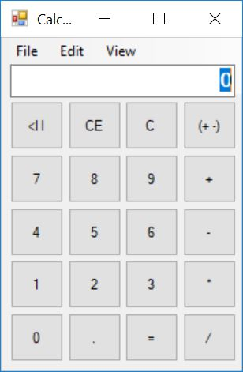
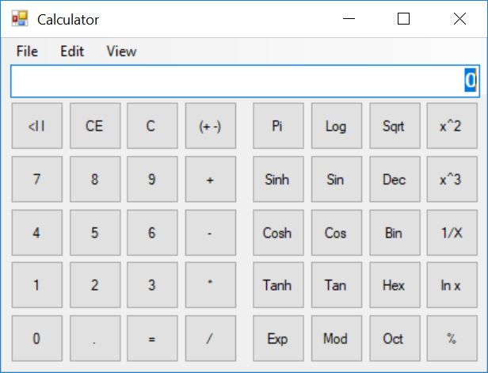
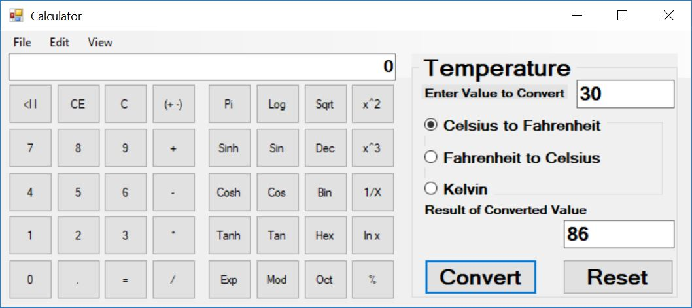
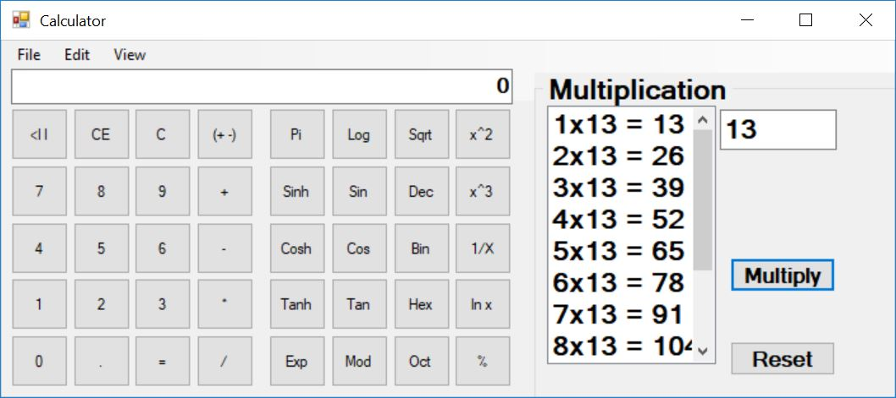

# cs_calculator
A desktop scienfitic calculator using .Net Framework and Winform.  
By using the menu-strip in the top, the user can select 4 different modes

<table  border = "1">
  <tr> <th> Screenshot </th> <th> Description </th> </tr>
  <tr> <td align ="center">  </td> <td> <b>a simple standard calculator </b>  </td> </tr>
  <tr> <td align ="center">  </td> <td> <b>a scientific calculator </b> </td> </tr>
  <tr> <td align ="center">  </td> <td> <b>a scientific calculator with mathmatical operations </b> </td> </tr>
  <tr> <td align ="center">  </td> <td> <b>a scientific calculator with with a series of mulitplicaion </b> </td> </tr>
</table>

